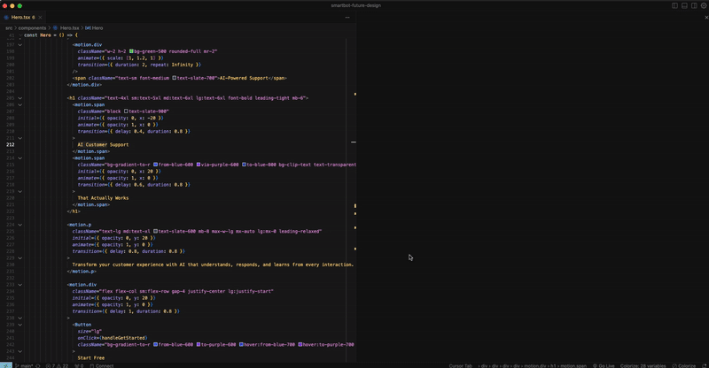

# 🌐 Web URL Preview — VS Code Extension

Open and preview any website or local development server (e.g., `localhost:3000`) directly inside Visual Studio Code using a simple command.

 <!-- Optional demo GIF -->

---

## 🚀 Features

- 📡 Preview **any URL** (including `http`, `https`, and `localhost`)
- 🧪 Perfect for testing **local dev servers** without leaving your IDE
- 🗂 Supports opening **multiple tabs**
- 🔐 Secure sandboxed iframe environment
- 🧘 Minimal, focused experience with no unnecessary bloat

---

## 🛠 Usage

1. Open **Command Palette**: `Cmd + Shift + P` or `Ctrl + Shift + P`
2. Type: `Open Web URL Preview`
3. Enter any URL, e.g.:
   - `https://example.com`
   - `http://localhost:3000`

A new VS Code tab will open and render the page inside an iframe.

---

## 📦 Installation

### From Marketplace (coming soon):
```bash
# After publishing:
code --install-extension bishosilwal.web-url-preview
